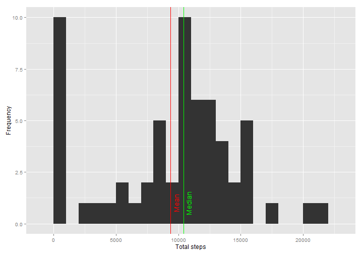
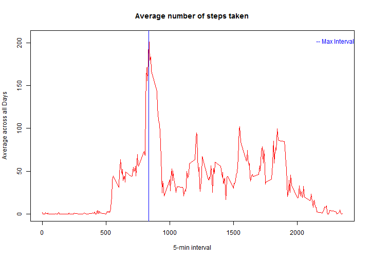
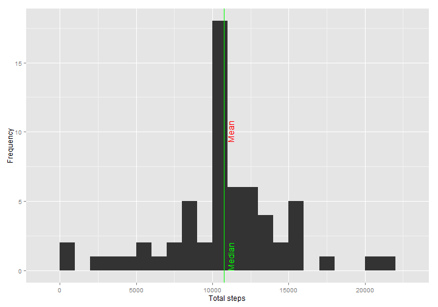
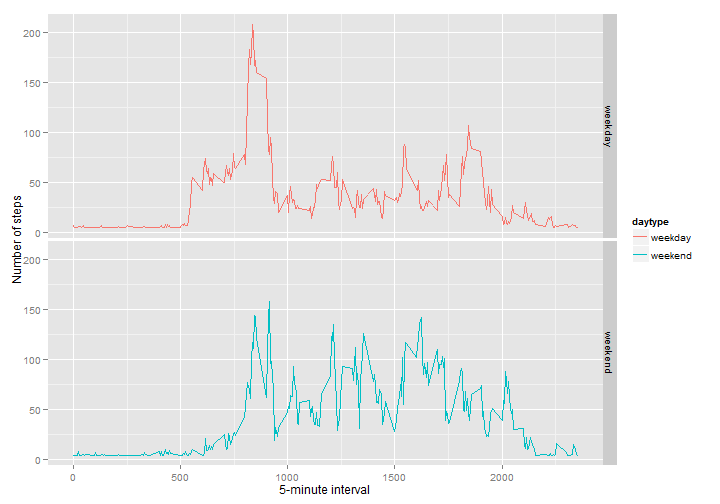

## Set global variables and load required libraries

```r
library(knitr)
library(ggplot2)
library(Hmisc)

opts_chunk$set(echo=TRUE, results='asis', fig.width=10)
```

## Loading and preprocessing the data


Load the data.

```r
if(!file.exists('activity.csv')){
    unzip('activity.zip')
}
activity <- read.csv('activity.csv')
```

Process/transform the data (if necessary) into a format suitable for your analysis

```r
activity$date <- as.Date(activity$date, "%Y-%m-%d")
```


## What is mean total number of steps taken per day?
Calculate the steps, mean and median total number of steps taken per day

```r
total.steps <- with(activity,tapply(steps, date, sum, na.rm=TRUE))
total.mean <- mean(total.steps)
total.median <- median(total.steps)
```

Make a histogram of the total number of steps taken each day. The graph also shows mean and median. 

```r
qplot(total.steps, xlab='Total steps', ylab='Frequency', binwidth=1000) +
geom_vline(xintercept = total.mean, colour="red") + 
geom_text(aes(x=total.mean, label="\nMean", y=1), colour="red", angle=90, text=element_text(size=12)) +
geom_vline(xintercept = total.median, colour="green") +
geom_text(aes(x=total.median, label="\nMedian", y=1), colour="green", angle=90, text=element_text(size=12)) 
```

 

Report the mean and median total number of steps taken per day

```r
print(paste('Mean = ', toString(total.mean)))
```

[1] "Mean =  9354.22950819672"

```r
print(paste('Median = ', toString(total.median)))
```

[1] "Median =  10395"


## What is the average daily activity pattern?
Make a time series plot (i.e. type = "l") of the 5-minute interval (x-axis) and the average number of steps taken, 
averaged across all days (y-axis)

```r
average.steps <- with(activity,tapply(steps, interval, mean, na.rm=TRUE))

plot(row.names(average.steps), average.steps, type = "l", xlab = "5-min interval", 
     ylab = "Average across all Days", 
     main = "Average number of steps taken", col = "red")

max.interval <- as.numeric(names(which.max(average.steps)))
abline(v=max.interval,col="blue")
mtext(side=3,line=-2,adj=1," -- Max Interval",col="blue")
```

 

Which 5-minute interval, on average across all the days in the dataset, contains the maximum number of steps?

```r
max.interval
```

[1] 835

## Imputing missing values

# How many missing

Calculate and report the total number of missing values in the dataset (i.e. the total number of rows with NAs)

```r
activity.missing <- sum(is.na(activity))
```

Devise a strategy for filling in all of the missing values in the dataset. The strategy does not need to be sophisticated. 
For example, you could use the mean/median for that day, or the mean for that 5-minute interval, etc.

```r
activity.filled <- activity
activity.filled$steps <- with(activity.filled, impute(steps, mean))
```

Create a new dataset that is equal to the original dataset but with the missing data filled in.

```r
total.filled.steps <- with(activity.filled,tapply(steps, date, sum, na.rm=TRUE))
```

Make a histogram of the total number of steps taken each day and Calculate and report the mean and median total number of 
steps taken per day. Do these values differ from the estimates from the first part of the assignment? What is the impact 
of imputing missing data on the estimates of the total daily number of steps?

The graph also shows mean and median. Interestingly, both mean and median are same.

```r
total.filled.mean <- mean(total.filled.steps)
total.filled.median <- median(total.filled.steps)
qplot(total.filled.steps, xlab='Total steps', ylab='Frequency', binwidth=1000) +
geom_vline(xintercept = total.filled.mean, colour="red") + 
geom_text(aes(x=total.filled.mean, label="\nMean", y=10), colour="red", angle=90, text=element_text(size=12)) +
geom_vline(xintercept = total.filled.median, colour="green") +
geom_text(aes(x=total.filled.median, label="\nMedian", y=1), colour="green", angle=90, 
          text=element_text(size=12)) 
```

 

## Are there differences in activity patterns between weekdays and weekends?

Create a new factor variable in the dataset with two levels – “weekday” and “weekend” indicating whether a given date is 
a weekday or weekend day.

```r
day.type <- function(date) {
    if (weekdays(date) %in% c('Saturday', 'Sunday')) {
        return('weekend')
    } else {
        return('weekday')
    }
}

day.types <- sapply(activity.filled$date, day.type)
activity.filled$daytype <- as.factor(day.types)
```

Make a panel plot containing a time series plot (i.e. type = "l") of the 5-minute interval (x-axis) and the average number 
of steps taken, averaged across all weekday days or weekend days (y-axis). See the README file in the GitHub repository to 
see an example of what this plot should look like using simulated data.

```r
averages <- aggregate(steps ~ interval + daytype, data=activity.filled, mean)

ggplot(averages, aes(interval, steps)) + geom_line(aes(color=daytype)) + facet_grid(daytype ~ .) + 
       xlab("5-minute interval") + ylab("Number of steps")
```

 
